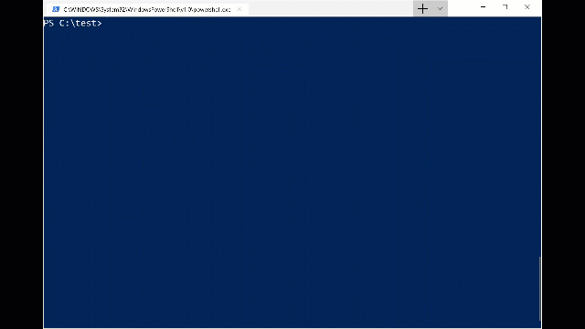

# .Net global tool to create standard project structure

## Overview

This is a project that builds a dotnet global tool that, when run, helps setup a file/folder structure similar to the Microsoft open source projects. The global tool will check for the following items

### Items that are checked for
- Folders
    - src
- Files
    - .gitignore [What is .gitignore?](https://git-scm.com/docs/gitignore)
    - .editorconfig [What is .editorconfig](https://editorconfig.org/)
    - README.MD
    - CONTRIBUTING.MD [What is a contributing document?](https://github.blog/2012-09-17-contributing-guidelines/)
    - LICENSE.txt [Help with choosing an open source license](http://www.choosealicense.com)

## Requirements

- .Net core 2.2 or greater

## Installation

This global tool is available on the standard [nuget.org](https://www.nuget.org/packages/DotnetSetupProjectStructure/) package distribution system and you can install it with the following command

```sh
dotnet tool install --global DotnetSetupProjectStructure
```

This will install the tool as a global tool that you can use in any directory.

## Executing the tool

If you need to install the global tool, please see the "Installation" section.

Once you have the global tool installed, you can run it in two modes.
1. PreCheck mode - This mode will run a preflight check of your project directory for the standard files and folders. At the end of this check you will get an output like the following of which files/folders exists and which files/folders would get created if you ran the tool in the default mode.

2. Default - In the default mode of the global tool, it will create files and folders that do not already exist, with some simple defaults. **The tool will not overwrite any file or folder that already exists.**

To run the global tool in the default mode execute it like the following.
```sh
$ setup-project
```
You should see output similar to the following


To run the global tool in the preflight check mode execute it like the following
```sh
$ setup-project --precheck
```
You should see output similar to the following


## Submitting feature and bug reports

- Feature requests - [You can use this feature template](https://github.com/johnmcbride/globaltool.projectstructure/issues/new?assignees=&labels=enhancment&template=feature_request.md&title=)
- Filing bug reports [Use this bug report template](https://github.com/johnmcbride/globaltool.projectstructure/issues/new?assignees=&labels=bug&template=bug_report.md&title=)

## License

This project is licensed under the MIT license. Please see the [LICENSE file](./LICENSE)

## Contributors

John McBride [(twitter)](https://www.twitter.com/johnmcbride)